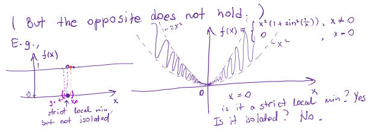
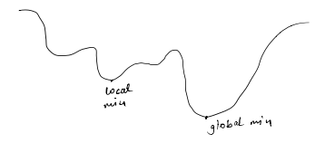

COMPSCI726: Nonlinear Optimization I
  

Notebook

Zijie Zhang 

- [Overview](#overview)
  - [Basic Information](#basic-information)
  - [Textbook](#textbook)
  - [Workload and Assessment](#workload-and-assessment)
  - [Topics Covered in Class](#topics-covered-in-class)
- [Lecture 1](#lecture-1)
  - [Our standard optimization problem:](#our-standard-optimization-problem)
  - [Specifying the optimization problem](#specifying-the-optimization-problem)
- [Lecture 2](#lecture-2)
- [Lecture 3](#lecture-3)
  - [**A Taxonomy of solutions to (P)**](#a-taxonomy-of-solutions-to-p)
  - [Taylor's Theorem:](#taylors-theorem)

>
2020/09/04/Friday === Create Notebook

# Overview
## Basic Information
**Meetings:** Mon and Wed 2.30-3.45pm on BBC Ultra   
**Instructor:** Jelena (pronounced as Yelena) Diakonikolas  
**Email:** <jelena@cs.wisc.edu>  
**Office hours:** Mon 9-10am and 4-5pm  
**TA:**  Eric Lin  <clin353@wisc.edu>; OH: Wed 9-10am and 4-5pm

## Textbook
_Nocedal & Wright (Numerical Optimization, 2nd ed, 2006)_  

## Workload and Assessment
* Homework (5-6):
  * 30% of the grade
  * a combination of math problems and coding assignments
  * no collaboration allowed; any discussion must be verbal-only
* Midterm:
  * 30% of the grade
  * to be scheduled in mid-October
  * typically 4 multi-part questions of a similar format/difficulty as homework questions
* Final:
  * 40% of the grade
  * scheduled for 12/16/2020
  * similar format to midterm

## Topics Covered in Class
* Introduction: optimization background; convex sets; convex functions; convergence rates.
* Background on smooth unconstrained optimization: Taylor theorem and optimality conditions.
* First-order methods:
  * gradient descent for convex and nonconvex optimization, line search methods
  * projections, gradient mapping, and their use in projected gradient descent
  * Bregman divergence and mirror descent
  * Nesterov acceleration for convex optimization
  * conjugate gradients; lower bound for smooth convex minimization
  * conditional gradients (Frank-Wolfe methods)
  * stochastic gradient descent
* Second-order methods
  * Newton method
  * trust-region Newton
  * inexact Newton methods and Newton-CG
  * cubic regularization
  * quasi-Newton methods (DFP, BFGS, SR-1, general Broyden class)
  * limited-memory quasi-Newton (L-BFGS)

# Lecture 1
## Our standard optimization problem:
$$ \min_{x\in X} f(x) \ \ \ \ \ (P)$$
where $x$ is **vector**, $X$ is **feasible set**, $f(x)$ is **objective function**.  
$$ max_{x\in X} f(x) \Leftrightarrow \min_{x\in X} -f(x) $$

the value of (P): val(P) = $\inf_{x\in X}f(x)$.  
To give (P) a meaning, we need to specify:
* vector space, feasible set, objective function
* what is means to "solve" (P)  

Q: Can we even hope to solve an aribitrary opt. problem?  
Ex: Can you come up with an example of positive integers $x,y,z$ s.t. (Pythagorean triples)
$$x^2+y^2=z^2$$
(3,4,5); (5,12,13); (8,15,17) ...  
How about $x^3+y^3=z^3$ ?
* Fermat's conjecture [Fermat's Last Theorem](https://en.wikipedia.org/wiki/Fermat%27s_Last_Theorem)  
For any $n\geqslant 3, x^n+y^n=z^n$ has no solutions over positive integers.  
Proved by [Andrew Wiles](https://en.wikipedia.org/wiki/Andrew_Wiles) in 1994.  
Consider: $P_F$
$$ 
\left\{
             \begin{array}{lr}
             \min_{x,y,z,n}(x^n+y^n-z^n), &  \\
             s.t. \ \ \ \ x\geqslant 1, y \geqslant 1, z \geqslant 1, n \geqslant 3\\
             \sin^2(\pi n)+\sin^2(\pi x)+\sin^2(\pi y)+\sin^2(\pi z)=0 &  
             \end{array}
\right.
$$

If you could certify whether $val(P_F)\not ={0}$, you would have found a proof for Fermat's conjecture.

* Ex: Unconstrainted optimation, many minima:
  "Arbitrary optimization problems are hopeless, we always need some structive"
## Specifying the optimization problem
1. **Vector space**(where the optimization variables and the feasible set "live")  
  $(\mathbb{R}^d, ||\cdot||)$:normed vector space
* Most often, we will take $||x||=||x||_2 = \left(\sum_{i=1}^d x_i^2\right)^{\frac{1}{2}}$
* We might sometimes also consider $l_p$ norms:
$$ ||x||_p = \left(\sum_{i=1}^d x_i^p\right)^{\frac{1}{p}} , p\geqslant 1$$
$$ ||x||_1 = \sum_i |x_i|, \ \ ||x||_\infty = \max_{1\leqslant i \leqslant d} |x_i| $$
>
Updated on 2020/09/04/Friday

- - - -
>
2020/09/09/Wednesday

# Lecture 2
We will use $\langle \cdot,\cdot \rangle$ to denote inner products.  
Standard inner product:
$$ \langle x,y \rangle=x^T y = \sum_{i=1}^d x_i y_i $$
**When we work with $(\mathbb{R}^d, ||\cdot||_p)$, view $\langle y, x \rangle$ as the value of a linear function $y$ at $x$. So, if we are measuring the length $x$ using the $||\cdot||_p$, we should measure the length of $y$ using $||\cdot||_{p^*}$, where $\frac{1}{p}+\frac{1}{p^*}=1.$**  
dual norm:$||z||_* = \sup_{||x||\leqslant 1}\langle z,x \rangle$  
$$\forall z,x:\langle z,x \rangle \leqslant ||z||_* \cdot ||x|| $$
*proof:* Fix any two vectors $x,z$. Assume $x \not ={0}, z\not ={0}$, o.w. trivial. Define $\hat{x}=\frac{x}{||x||}$.
$$||z||_* \geqslant \langle z,\hat{x} \rangle = \frac{\langle z,x \rangle}{||x||}$$

2. **Feasible set**:
  * specifies what solution points we are allowed to output $X \subseteq \mathbb{R}^d$. If $x=\mathbb{R}^d$, we say that (P) is unconstrained. o.w., we say that (P) is constrained.  
$X$ can be specified:
* as an abstract geometric body (a ball, a box, a polyhedron)
* via functional constraints: $g_i(x)\leqslant 0, i=1,2,\cdots, m.$, $\mu_i(x)=0, i=1,2,\cdots, p$.
$$ f_i(x) \geqslant C \Leftrightarrow g_i(x)=C-f_i(x)$$
E.g., $X = \mathcal{B}_2(0,1)$ (Unit Euclidean ball) $X = \{ x\in \mathbb{R}^d:||x||_2\leqslant 1\}$
* In this class, we will always assume that X is **closed** and **convex**.

* **Heine-Borel Thm:** If X is closed and bounded, then it is compact.  
*If $X\subseteq U_{\alpha \in A} U_\alpha$ for some family of open sets $\{U_\alpha\}$ then $\exist$ a finite subfamily $\{U_{\alpha_i}\}_{i=1}^n$ s.t. $X \subseteq U_{1\leqslant i \leqslant n} U_{\alpha_i}$*
* **Weierstrass Exrtreme Value Theorem:** If X is compact and $f$ is a function that is defined and continous on X, then $f$ attains its extreme values on X.
* What if X is not bounded?  
Consider $f(x)=e^x$, $\inf_{x\in \mathbb{R}} f(x)=0$.

* When we work with unconstrained problems, we will normally assume that $f$ is bounded below.
* Convex sets:  
**Def:** A set $X \subseteq \mathbb{R}^d$ is convex if ($\forall x,y \in X$)($\forall \alpha \in (0,1)$): $(1-\alpha)x+\alpha y \in X$. 
$x+\alpha(y-x)$

3. **Object function:**
* "cost", "loss"
* Extended real valued functions:
$$f: \mathcal{D}\to \mathbb{R} \cup \{-\infty, \infty\}$$
* We will define $f$ on all of $\mathbb{R}^d$ by assigning it value $+\infty$ at each point $X\in \mathbb{R}^d \setminus \mathcal{D}$.
* Effective domain: $dom(f)=\{x\in \mathbb{R}^d:f(x) < \infty\}$.
* "nonlinear opt" =(?) "continuous opt"
* Lower semicontinuous functions:
**Def:** A function $f:\mathbb{R}^d \to \bar{\mathbb{R}}$ if
$$\liminf_{y\to x} f(y) \geqslant f(x)$$
f is l.s.c. on $\mathbb{R}^d$ if it is l.s.c. at all $X\in \mathbb{R}^d$.

Ex. indicator of a **closed** set is l.s.c.
$$ 
I_X(x)=
\left\{
             \begin{array}{lr}
             0&, x\in X\\
             \infty &, x\not\in X\\
             \end{array}
\right.
$$
$\min_{x\in X} f(x) \equiv \min_{x \in \mathbb{R}^d}\{f(x) + I_X(x)\}$
* Unless we are abstracting away constraints, the least we will assume about $f$ is that it is continuous.
* **Def:** $f:\mathbb{R}^d \to \bar{\mathbb{R}}$ is said to be:
  * *Lipschitz-continuous* on $X\subseteq \mathbb{R}^d$ if $\exist M < \infty$  
  $\forall x, y \in X: |f(x)-f(y)| \leqslant M ||x-y||$.
  * Smooth on $X\subseteq \mathbb{R}^d$ if $f$'s gradients are *Lipschitz-continuous*, i.e., $\exist L < \infty$ s.t. $\forall x,y \in X$:
  $$||\nabla f(x)-\nabla f(y)||_* \leqslant L ||x-y||$$
   
  * **Def:** $f:\mathbb{R}^d \to \bar{\mathbb{R}}$ is convex if $\forall x,y\in \mathbb{R}^d, \forall \alpha \in (0,1)$:
  $$f((1-\alpha)x+\alpha y) \leqslant (1-\alpha)f(x) + \alpha f(y)$$
  

  * Ex. function that is  differentiable on its domain but not smooth: $f(x)=\frac{1}{x}, dom(f)=R_{++}$
  

  * **Def:** We say that a function $f:\mathbb{R}^d \to \bar{\mathbb{R}}$ is **proper** if $\exist x \in \mathbb{R}^d$ s.t. $f(x) \in \mathbb{R}$.
>
Updated on 2020/09/09/Wednesday

- - - -
>
2020/09/14/Monday

# Lecture 3

(P) $\min_{x \in \mathcal{X}} f(x)$  
## **A Taxonomy of solutions to (P)**
* Terminology: I will not distinguish b/w "**solution**" and "**minimizer**".  
* **Def:** We say that $x^* \in \text{dom}(f)$ is:
  1. a local minimizer of (P) (or a local solution to(P)) if $\exists$ a neighborhood $\mathcal{N}_{x^*}$ of $x^*$ s.t. $\forall x \in \mathcal{N}_{x^*} \cap \mathcal{X}$ we have $f(x) \geqslant f(x^*)$. 
  2. a strict local minimizer of (P) if it satisfies (1)  but the inequality is strict: $f(x) > f(x^*)$.
  3. a global minimizer of (P) if $\forall x \in \mathcal{X}$: $f(x) \geqslant f(x^*)$.
  4. an isolated local minimizer of (P), if $\exists$ a neighborhood $\mathcal{N}_{x^*}$ s.t. $\forall x \in \mathcal{N}_{x^*} \cap \mathcal{X}$:$f(x) \geqslant f(x^*)$ and $\mathcal{N}_{x^*}$ does not contain any other local minimizers.
* *Ex*. Every isolated local minimizer is strict.  
  *(But the opposite does not hold.)*  
  E.g.,  

## Taylor's Theorem:
* For this part and until explicitly stated otherwise, we will be assuming that $f$ is at least once continuously differentiable.
* Taylor's Theorem for 1D functions from calculus:  
  $f:\mathbb{R} \to \mathbb{R}$, $f$ k-times continuously differentiable.  
  $\Rightarrow \forall x, y \in \mathbb{R}$

>
Updated on 2020/09/14/Monday
