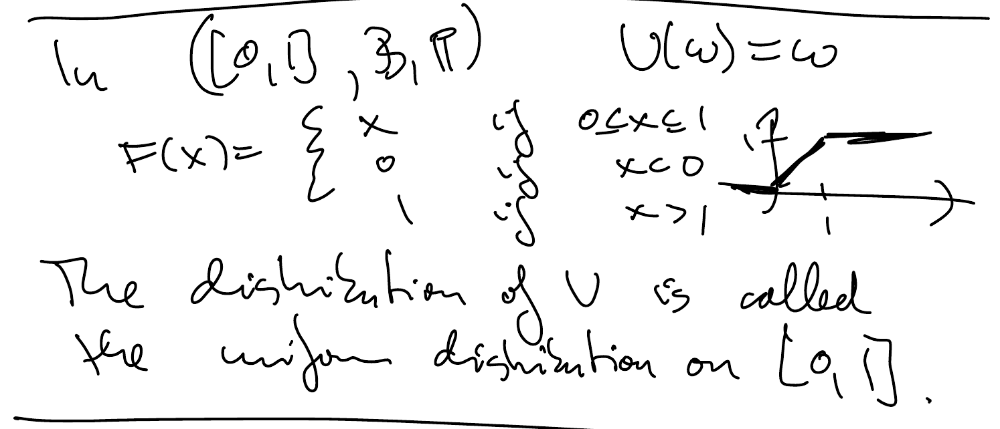

Math/Stat 733 : Theory of Probability I
  

Notebook

Zijie Zhang 

- [Overview](#overview)
  - [Basic Information](#basic-information)
  - [Textbook](#textbook)
    - [Extra Reading](#extra-reading)
  - [Course content](#course-content)
  - [Evaluation](#evaluation)
- [Introduction](#introduction)
  - [What is probability theory?](#what-is-probability-theory)
  - [Simple example with built in symmetry](#simple-example-with-built-in-symmetry)
- [Lecture 1](#lecture-1)
  - [Kolmogorov's axioms(1933)](#kolmogorovs-axioms1933)
  - [Probability Space ($\Omega, \mathscr{F}, \mathbb{P}$)](#probability-space-omega-mathscrf-mathbbp)
  - [Def of a $\sigma$-field(or $\sigma$-algebra)](#def-of-a-sigma-fieldor-sigma-algebra)
  - [Probability measure](#probability-measure)
    - [Examples:](#examples)
- [Lecture 2](#lecture-2)
  - [Word Problem:](#word-problem)
    - [Ex: We roll two dice](#ex-we-roll-two-dice)
    - [Examples:](#examples-1)
  - [2nd Part](#2nd-part)
- [Lecture 3](#lecture-3)
  - [Probability measures on $\mathbb{R}$](#probability-measures-on-mathbbr)
  - [Random variables](#random-variables)
  - [Random variables and distributions](#random-variables-and-distributions)
- [Lecture 4](#lecture-4)
  - [Properties of random variables](#properties-of-random-variables)
  - [Integration with respect to a probability measure](#integration-with-respect-to-a-probability-measure)

>
2020/08/29/Saturday === Create Notebook

# Overview
## Basic Information
**Meetings:** TR 1pm-2:15pm (online)  
**Instructor:** Benedek Valkó  
**Email:** <valko@math.wisc.edu>  
**Office hours:** Tu 4-5pm, F 3-4pm, or by appointment (online)

## Textbook
_Richard Durrett: Probability: Theory and Examples, 5th edition, 2019_  
### Extra Reading
* Olav Kallenberg: Foundations of Modern Probability. 2nd edition, Springer, 2002
* William Feller. An introduction to probability theory and its applications. Vol. I. Third edition. John Wiley and Sons Inc., New York, 1968.
* David Williams. Probability with martingales. Cambridge Mathematical Textbooks. Cambridge University Press, Cambridge, 1991.
* Patrick Billingsley. Probability and measure. Wiley Series in Probability and Mathematical Statistics. John Wiley \& Sons Inc., New York, 1995.

## Course content
We cover selected portions of Chapters 1-4 of Durrett. This is a rough course outline:  
* Weeks 1-2: Foundations, properties of probability spaces
* Independence, 0-1 laws, strong law of large numbers
* Characteristic functions, weak convergence and the central limit theorem
* Conditional expectation, Martingales  
The course continues in the spring semester as Math 734 covering topics such as Markov chains, stationary processes, ergodic theory, and Brownian motion.

## Evaluation
Course grades will be based on **biweekly**
* home work assignments (25%)
* class participation (15%)
* midterm exam (30%)
* final exam (30%)  
See the _Canvas_ page for more information  

>
Updated on 2020/08/29/Saturday

- - - -
>
2020/09/03/Thursday

# Introduction
Upload Homework 1 on Canvas before Sep 13.  
* Midterm exam and final exam, open book.
* Midterm is evening exam.
* Textbook is _Richard Durrett: Probability: Theory and Examples, 5th edition, 2019_.
* Lecture Notes will be uploaded.

## What is probability theory?
**Goal:** model uncertain events, quantify...  
## Simple example with built in symmetry
1. Filp a fair coin. What's the probability of tails?  
   Normal average : $\frac{1}{2}$  
2. We filp a fair coin 10 times. 
   What's the probability of getting 10 tails?  $\frac{1}{2^{10}}$  
   $2^{10}$ outcomes, each outcome : a sequence of H/T  
3. Dartboard with radius 10in, bull's seye: a disc of radius 1in.  
   We throw a dart at the board. What's the probability of hitting the bull's eye? $\frac{1}{100}$  
...

# Lecture 1
## Kolmogorov's axioms(1933)
## Probability Space ($\Omega, \mathscr{F}, \mathbb{P}$)
* $\Omega$: sample space
* $\mathscr{F}$: set of events
* $\mathbb{P}$: probability measure on $\mathscr{F}$
## Def of a $\sigma$-field(or $\sigma$-algebra)
1. If $A \in \mathscr{F}$ then $A^c \in \mathscr{F}$
2. If $A_i \in \mathscr{F}, i\in \mathbb{N}$ then $\cup_i A_i \in \mathscr{F}$  
$\emptyset \in \mathscr{F}, \ \Omega \in \mathscr{F}$  
If $\mathscr{F}_i, i \in \mathcal{I}$ on $\Omega$ then $\cap \mathscr{F}_i$ is also a $\sigma$-field.  

Suppose that $\mathscr{A}$ is a non-empty set of subsets of $\Omega$. Then there is a smaller $\sigma$-field that contains $\mathscr{A}$ as a subset.  
$\sigma(\mathscr{A})$: $\sigma$-field generated by $\mathscr{A}$.  
*Proof* : Collect all $\sigma$-field $\mathscr{F}_i$ on $\Omega$ with $\mathscr{A} \subset \mathscr{F}_i$.  
Then $\sigma(\mathscr{A}) = \cap_i \mathscr{F}_i$.  
$2^{\Omega}$ is a $\sigma$-field so the intersection is non-empty.&#8718;
## Probability measure
1. $\mathbb{P}$ : $\mathscr{F} \to [0,1]$  
   $\mathbb{P}(\emptyset)=0$.
2. $\mathscr{A}_i \in \mathscr{F}, \ i \in \mathbb{N}$ disjoint  
   $\mathbb{P}(\cup_i \mathscr{A}_i)=\sum_i \mathbb{P}(\mathscr{A}_i)$  
   $\mathbb{P}$ is $\sigma$-additive.
3. $\mathbb{P}(\Omega)=1$.  
Events are elements of $\mathscr{F}$. These are the sets that we can measure with $\mathbb{P}$.

$A_i, A_2, \cdots, A_n$ are disjoint events $\mathbb{P}(\cup_{i=1}^n A_i)=\sum_{i=1}^n \mathbb{P}(A_i)$.($\emptyset$ is disjoint from any other set).

If $\Omega$ is **finite** or **countable infinite** then usually we can take $\mathscr{F}=2^{\Omega}$.

### Examples:
1. Flipping a fair coin  
   $\Omega = {H, T}$  
   $\mathscr{F} = \{\emptyset, \Omega, \{H\}, \{T\}\}$  
   $\mathbb{P}(\{H\}) =\frac{1}{2}$, $\mathbb{P}(\{T\}) =\frac{1}{2}$  
   $\mathbb{P}(\emptyset) =0$, $\mathbb{P}(\Omega) =1$
2. Rolling a fair die  
   $\Omega = \{1,2,3,4,5,6\}$  
   $\mathscr{F} = 2^{\Omega}$  
   $\left|\mathscr{F}\right|=2^6$  
   $\mathbb{P}(\{\epsilon\}) = \frac{1}{6}$, $1\leqslant \epsilon \leqslant 6$  
   $A \in \mathscr{F}$, $\mathbb{P}(A) = \frac{\#A}{6}$
3. Random experiment with $n$ equally likely outcomes  
   $\left|\Omega\right|=n$  
   $\Omega = \{\omega_1, \omega_2, \cdots, \omega_n\}$  
   $\mathscr{F} = 2^{\Omega}$  
   $\mathbb{P}\{\omega_i\} = \frac{1}{n}$, $1 \leqslant i \leqslant n$  
   $\mathbb{P}(A) = \frac{|A|}{|\Omega|}$, $A \subset \Omega$
4. More generally:  
   discrete probability space, $\Omega$ is **finite** or **countable infinite**  
   $\Omega = \{\omega_1, \omega_2, \cdots, \omega_n\}$  
   $\mathbb{P}\{\omega_i\} = p_i$  
   $\mathbb{P}(A) = \sum_{\omega_i\in A}\mathbb{P}(\{\omega_i\})$  
   $\mathscr{F} = 2^{\Omega}$  

>
Updated on 2020/09/03

 - - - -
>
2020/09/08/Tuesday

# Lecture 2
## Word Problem:
1. Identify $(\Omega, \mathscr{F}, \mathbb{P})$
2. Identify the event in question
3. Try to compute $\mathbb{P}(event)$.
### Ex: We roll two dice
What's the probility that the sum is even?
$\Omega = \{(a_1,a_2): 1 \leqslant a_i \leqslant 6\}$  
$\mathscr{F}=2^\Omega$, $\mathbb{P}:\mathscr{F}\to (0,1]$  
$\mathbb{P}(\{(a_1,a_2)\}) = \frac{1}{36}$  
$\# \Omega = 36$, $A = \{the\ sum\ is\ even\} = \{(a_1, a_2): 1\leqslant a_i \leqslant 6, a_1+a_2 \ is\ even\}$.  
$\mathbb{P}(A) = \sum_{(a_1,a_2)\in A} \mathbb{P}(\{(a_1,a_2)\}) = \frac{\# A}{36}$.
### Examples:
1. If $\Omega$ is finite or countable infinite (nonempty). If all all singleterms are events then $\mathbb{P}$ can be described via the probabilities of the singleterms.  
   $\Omega = \{\omega_1, \omega_2, \cdots\}$, $\mathbb{P}_\epsilon = \mathbb{P}(\{\omega_\epsilon\})\in [0,1]$, $\sum_{\epsilon} \mathbb{P}_\epsilon = 1$.
2. A uniformly chosen number on $[0,1]$.  
   $\Omega = [0,1]$, $\mathscr{F} = ?$ intervals should be included.  
   $\mathbb{P}([a,b]) = b-a, 0 \leqslant a \leqslant b \leqslant 1$.  
   $\mathscr{F} = $ $\sigma$-field generated by the intervals (set of Borel sets in [0,1])  
   $\mathbb{P}$: **Lebesgue measure**
   $$([0,1], \mathscr{B}, \mathbb{P})$$  
   More general version:  
   Let $\Omega \subset \mathbb{R}^n$ be a Borel set with finite **Lebesgue measure**.
   $$(\Omega, \mathscr{B}, \mathbb{P})$$
   $\mathbb{P}(A) = \frac{|A|}{|\Omega|}$, $\mathscr{B}$ is Borel subsets of $\Omega$.  
   **Uniformly Chosen point from $\Omega$**
3. Product spaces  
   $(\Omega_i, \mathscr{F}_i, \mathbb{P}_i)$ probability spaces, $i\in\mathcal{I}\in$finite/infinite.  
   $\Omega = x_i \Omega_i$  
   $\mathscr{F} = \sigma(x_i\mathscr{F}_i)$
   $\mathbb{P} = x\mathbb{P}_i
4. $(\Omega, \mathscr{F}, \mathbb{P})$ is a probability space.  
   $B\in\mathscr{F}$, $\mathbb{P}(B) > 0$  
   **Conditional Probability of A given B**  
   $Q(A) = \frac{\mathbb{P}(AB)}{\mathbb{P}(B)} = \mathbb{P}(A|B)$, $A\in\mathscr{F}$

## 2nd Part

>
Updated on 2020/09/08

>
2020/09/10/Thursday

# Lecture 3

$$([0,1],\mathscr{B}, \mathbb{P})$$
$a\in [0,1]$,$\mathbb{P}(\{a\})=0$, 
$\{a\}\subset [a,a+\epsilon]$, 
$\mathbb{P}(\{a\}) \leqslant \epsilon \to \mathbb{P}(\{a\})=0$  

## Probability measures on $\mathbb{R}$
$\mathbb{P}$ is a prob measure on $(\mathbb{R},\mathscr{B})$  
$${F}(x) = \mathbb{P}((-\infty, x]))$$
non-decreasing, right-cont.  
$$\lim_{x\to-\infty} F(x) = 0, \ \lim_{x\to\infty}F(x)=1$$

* **Theorem**: If $F:\mathbb{R}\to\mathbb{R}$ is nondecreasing, right-cont. with
  $\lim_{x\to\infty} F(x) -\lim_{x\to-\infty} F(x) = 1$ *(this)*
  then there is a unique prob measure $\mu$ such that $\mu((a,b]))=F(b)-F(a)$  
  More generally, without *(this)* condition, we get a measure $\mu$ on $(\mathbb{R},\mathscr{B})$.
* **Semialgebra**: collection of sets closed for intersection, complement is a finite disjoint union of some
  of those sets.
* **Algebra**: closed for union and complement ($\to$ intersection)  
  $$A,\ B \in \mathscr{G} \text{ then } A \cup B \in \mathscr{G},\ A^c \in \mathscr{G}$$
The algebra generated by given semialgebra is given by the collection of finite disjoint unions.  

**Theorem:** Let $S$ be a semialgebra and $\mu$ a set function $S \to \mathbb{R}_+$
which is finitely additive:  
If $A_1, A_2, \cdots, A_n\in S$ disjoint then
$\mu(\cup_{\epsilon=1}^n A_\epsilon)=\sum_{\epsilon=1}^n\mu(A_\epsilon)$
and if it is $\sigma$-sub additive:  
$A_1, A_2, \cdots, A_n\in S$ disjoint
$\mu(\cup_{\epsilon=1}^n A_\epsilon)\leqslant\sum_{\epsilon=1}^n\mu(A_\epsilon)$  
Then $\mu$ has a unique extension to the algebra generated by $S$, and if the extension is
$\sigma$-finite then that is a unique extension to $\sigma(S)$.  
The extension is a **measure**!  
*we can cover $\Omega$ with countabily many finte measure sets.*

$$(a,b] \cup (b,c] = (a,c]$$
$$(a,b]^c = (-\infty,a] \cup (b,\infty]$$

Extension to $\mathbb{R}^d$
  $d=2$, $\mu$ is a measure on ($\mathbb{R}^2,\mathscr{B})$  
  $F(x,y)=\mu((-\infty,x] \times (-\infty,y]))$  
    
  right-cont. (Wondering in both variables)  
   

## Random variables
$$X:\Omega \to \mathbb{R}$$
which is Borel measurable.
$$(\Omega, \mathscr{F}, \mathbb{R})$$
For any Borel set $\mathscr{B}$, the inverse image of $\mathscr{B}:$
$$X^{-1}(\mathscr{B}) = \{\omega \in \Omega:X(\omega)\in\mathscr{B}\}$$
is an event.
$$X^{-1}(\mathscr{B})\in\mathscr{F} \text{ for all Borel set }\mathscr{B}$$

What is the probability of $X \leqslant 2 \ ?$
$$\omega:\{X(\omega)\leqslant 2\} = X^{-1}\left((-\infty,2]\right)$$

**Claim**: If $\mathscr{A}$ generates $\mathscr{B}$ and $X^{-1}(A)\in \mathscr{F}$ for
$A\in \mathscr{A}$ then $X$ is a **r.v.**

Enough to check $X^{-1}\left((-\infty,c]\right)\in \mathscr{F}$ for all $c\in \Omega$.

Ex:
1. If $(\Omega,\mathscr{F},\mathbb {R})$s is discrete, then any
   $X:\Omega\to\mathbb{R}$ is a **r.v.**
2. Constant function is a **r.v.**  
   Indicator random variable:
   $$\mathbb{1}_A(\omega) = \left\{\begin{array}{lcl}
      1, &\text{if } \omega\in A\\
      0, &\text{if } \omega \in A^c
   \end{array}\right.$$
   We need $\emptyset, \Omega, A, A^c$ to be measurable, $A\in\mathscr{F}$, $A$ is an event.

## Random variables and distributions
Distribution of a **r.v.**  
$X$ is a r.v. on $(\Omega, \mathscr{F}, \mathbb R)$  
$\mu(A) = Q_X(A) = \mathbb{P}(X\in A)=\mathbb{P}(X^{-1}(A))$  
$\mu$ is a probability measure on $(\mathbb{R},\mathscr{B})$  
$\mu(\mathbb{R}) = \mathbb{P}(X\in \mathbb{R})=\mathbb{P}(\Omega)=1$  
check $\sigma$-additivits!

The distribution function (or cumulative distribution function) of a r.v. X is
$$F(x) = \mathbb{P}(X\leqslant x) = Q_X((-\infty,x])$$
Properties:
1. nondecreasing
2. right cont.
3. $\lim_{x\to\infty}F(x) = 1,\ \lim_{x\to -\infty}F(x)=0$

The CDF of X identified the distribution of X.

* Theorem: If F satisfies these conditions (1.2.3.) then there is a prob space $(\Omega,\mathscr{F}, \mathbb{R})$
  and a **r.v.** $X:\Omega \to \mathbb{R}$ so that the CDF of X is exactly F.  
 *proof:*  
 $([0,1], \mathscr{B},\mathbb{P})$, 
 $X(\omega) = \sup\{y:F(y)<\omega\}$  
 Suppose that the inverse $F^{-1}$ is well-defined, then $X(\omega)=F^{-1}(\omega)$.  
 $\mathbb{P}(X\leqslant x) = \mathbb{P}(F^{-1}(\omega)\leqslant x)=\mathbb{P}(\omega\leqslant F(x)) = \mathbb{P}([0,F(x)])=F(x)$  
 Try to finish the proof by considering the general case.  
 In $([0,1], \mathscr{B},\mathbb{P})$, $U(\omega)=\omega$  
 

* **Def:** If X and Y have the same distribution if $\mathbb{P}_1(X^{-1}(\mathscr{B}))=\mathbb{P}_2(Y^{-1}(\mathscr{B}))$  
  X lives on $(\Omega_1, \mathscr{F}_1,\mathbb{P}_1)$,
  Y lives on $(\Omega_2, \mathscr{F}_2,\mathbb{P}_2)$,  
  

* Ex: $(\Omega, \mathscr{F},\mathbb{P})$, we roll a fair die, $\Omega=\{1...6\}$  
  Give an example of two random variables on $(\Omega, \mathscr{F},\mathbb{P}_1)$
  with the same distribution.
  

The distribution of an indicator random variable:

$Q_X$ is supported on $\{0,1\}$  
$Q_X(\{0\})=\mathbb{P}(A^c)=1-\mathbb{P}(A)$  
$Q_X(\{1\})=\mathbb{P}(A)$
The distribution is identified by $\mathbb{P}(A)$.

* This distribution is called **Bernoulli** distribution with parameter $p$.  
  $p\in[0,1]$, $\mathbb{P}(\{ 1 \})$, $\mathbb{P}(\{0\}) = 1-p$.

**Homework**: Try to construct a r.v. with Bernoulli($p$) distribution on $([0,1],\mathscr{B},\mathbb{P})$.

$F$ is the CDF of X then $\mathbb{P}(X\in(a,b]))=\mathbb{P}(a<X\leqslant b)=F(b)-F(a)$.  
$\mathbb{P}(X=a) = F(a)-\lim_{x\to a^-}F(x)$.

If $F$ is the CDF of the r.v. X and there is a  measurable function $f$ so that $F(x)=\int_{-\infty}^x f(y)dy$
then $f$ is called the probability density function of X.  
$\mathbb{P}(X\in(a,b])=\int_a^b f(y)dy$, $\mathbb{P}(X\in \mathscr{B})=\int_\mathscr{B} f(y)dy$.
In this case we say that the distribution of X is **abs continuous**.

>
Updated on 2020/09/10

>
2020/09/15/Tuesday

# Lecture 4
## Properties of random variables

$(\Omega, \mathscr{F}, \mathbb{P})$ Probability Space.  
**(Real valued)** random variables:
$$X:\Omega\to \mathbb{R}, \ \text{Borel measurable}$$
Distribution of X: prob measure on $(\mathbb{R},\mathscr{B})$
with $Q_X(B)=\mathbb{P}(X^{-1}(B))=\mathbb{P}(X\in B)$  
Cumulative distribution function of X:
$$F_X(y) = \mathbb{P}(X\leqslant y)=Q_X((-\infty,y]), \ y\in \mathbb{R}$$
If $F(y)= \int_{-\infty}^{y} f(z) dz$ then $f$ is called the probability density function of X,
and $\mathbb{P}(X\in \mathscr{B})=\int_{{B}}f(y)dy$ for $B$ Borel.  
$f\geqslant 0,\ \int_{-\infty}^{\infty} f(x)dx =1$

If X is supported on a countable (distribution of X) set. (There is a countable set $S\subset \mathbb{R}$ so that
$\mathbb{P}(X\in S)=1$) then $Q_X$ can be described by the funciton $\mathbb{P}(a)=\mathbb{P}(X=a),\ a\in S$.  
**Probability mass function** of X (we say that X is a discrete r.v.).

Ex: Indicator random variable: $\mathbb{1}_A$.

Those general functions:  
We can have $\mathbb{R}^d$-valued functions or we can consider a measurable space $(\mathcal{X},S)$  
$$X: \Omega \to \mathcal{X}$$
we need $X^{-1}(A)\in \mathscr{F}$ for $A \in S$  
$Q_X$ is a probability measure on $(\mathcal{X},S)$ and $Q_X << \mu$ ($Q_X$ is abs. cont. with respect to $\mu$)
then  
R-N derivative $\frac{dQ_X}{d\mu}$  
$\mathbb{P}(X\in A)=\int_{A}\frac{dQ_X}{d\mu}d\mu$

* **Def:** If X is a r.v. on $(\Omega, \mathscr{F},\mathbb{P})$ then we denote by $\sigma(X)$ the smallest
  $\sigma$-field with repect to which X is measurable.
  $$\sigma(X) \subset \mathscr{F}$$
  $\sigma(X)=\sigma$-field generated by the sets $X^{-1}({B})$ with $B \in \mathbb{B}$.

Ex: $X=\mathbb{1}_A$, $\sigma(X) = \{\emptyset, \Omega, A, A^c\}$.

* **Notetion:** $X\in \mathscr{G} \in \sigma\text{-field}$, if $\sigma(X)\subset\mathscr{G}$.  
* **Recall:** measurable funcitions are pointwise limits of "Simple" function.  
* **simple function:** finite linear combinations of indicators,
$$X=\sum_{i=1}^n c_i \mathbb{1}_{B_i},\ \ \ \ c_i\in\mathbb{R}$$

* **Claim(Homework 2):**  
  Suppose that X and Y are random variables on $(\Omega, \mathscr{F}, \mathbb{P})$. Y is measurable w.r.t
  $\sigma(X)$ ($Y\in \sigma(X)$). If and only if $Y=f(X)$ for some measurable function $f$.  

  If X is r.v. and $f:\mathbb{R}\to\mathbb{R}$ measurable then $f(X)$ is also r.v. and if is measurable w.r.t
  $\sigma(X)$.

$$f:\mathbb{R}\to \mathbb{R}$$
$x_1,x_2,\cdots, x_n$ random variables on the same prob. space.
then $f(x_1, x_2,\cdots, x_n)$ is also a r.v.

**sums, products,min, max, inf, sup, liminf, limsup** of **countably** random variables is also a random variable.

If $X_1, X_2, \cdots$ is a sequence of r.v. on $(\Omega, \mathscr{F}, \mathbb{P})$ then the following sets are all
events
$$\{\limsup_{n\to \infty} X_n\leqslant C\}, \{\lim_{n\to \infty} X_n \text{  exists}\}, \{\lim_{n\to \infty} X_n=C\}$$
$$\{\lim_{n\to \infty} X_n \text{  exists}\}=\{\omega\in \Omega: \lim_{n\to \infty}X_n(\omega) \text{  exists}\}$$
So we can ask about
$$\mathbb{P}(\lim_{n\to \infty} X_n \text{ exists})$$

* **Def:** $\{X_n\}_{n\geqslant 1}$ converges almost surely of $\mathbb{P}(\lim_{n\to\infty}X_n \text{  exists})=1$
* **Def:** Slightly weahter type of convergence:  
  If for every $\varepsilon >0$ we have
  $$\lim_{n\to\infty}\mathbb{P}\left(|X_n-X|>\varepsilon\right)=0$$
  then we say that $X_n \to X$ is in probability
  $$X_n\to^{\mathbb{P}} X$$

## Integration with respect to a probability measure
**Q:** Is it possible to define a prob. space to 

>
Updated on 2020/09/15
