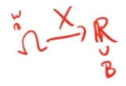

MATH735: Stochastic Analysis
  

Notebook

Zijie Zhang 

- [Review of Probability](#review-of-probability)
- [Review of conditional expectation](#review-of-conditional-expectation)

# Review of Probability

A probability space $(\Omega, \mathscr{F}, P)$.
* $\Omega$ is set of "outcomes".
* $\mathscr{F}$ : $\sigma$-algebra of "events" i.e. subsets of $\Omega$.
* $P$ : $\mathscr{F} \to [0,\infty)$ assigns a positive(non-neg) number to each event.

A random variable $X$ is a real-valued function defined on $\Omega$ s.t. for every borel set $B \in \mathscr{B}(\mathbb{R})$ we have $X^{-1}(B) = \{ w:X(x) \in B \} \in \mathscr{F}$.

(Rmk: can also talk about separable metric space)

# Review of conditional expectation
