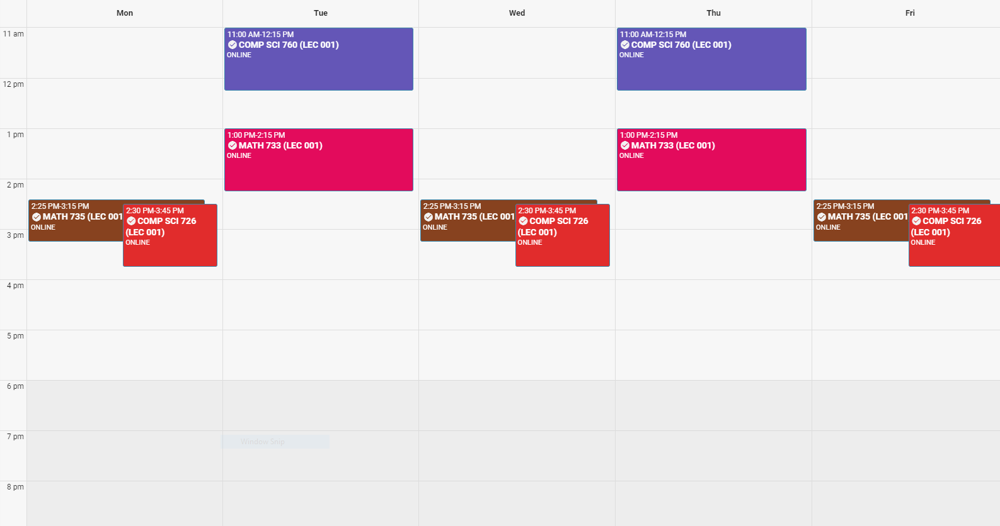

# 2020 Fall Progress

- [MATH 733](##math-733)
- [MATH 735](##math-735)
- [COMP 726](##comp-726)
- [COMP 760](##comp-760)

## MATH 733

- [x] 9/3/20 - First part (intro)
- [x] 9/3/20 - 2nd part (Kolmogorov axioms, examples)
- [x] 9/8/20 - 1st part (Further examples)
- [x] 9/8/20 2nd part (Properties of prob measures)
- [x] 9/10/20 1st part (measures on R)
- [x] 9/10/20 2nd part (random variables and distributions)
- [x] 9/15/20 1st part (properties of random variables)
- [ ] 9/15/20 2nd (integration with respect to a probability measure)
- [ ] 9/17/20 1st part (inequalities, limits and expectation)
- [ ] 9/17/20 2nd part (change of variables formula, variance)

- [x] [Homework 1 (Sep 13 @ 10pm)](/MATH733/Homework1/hw_1.pdf)
  - [x] [Solution](/MATH733/Homework1/solution_1.pdf)
- [x] [Homework 2 (Sep 27 @ 10pm)](/MATH733/Homework2/hw_2.pdf)
  - [x] [Solution](/MATH733/Homework2/solution_2.pdf)
- [x] [Homework 3 (Oct 11 @ 10pm)](/MATH733/Homework3/hw_3.pdf)
  - [ ] [Solution]

## MATH 735

- [x] [1.1 Review of Probability](/MATH735/1-01%20Review%20of%20Probability.pdf)
- [x] [1.2 Review of conditional expectation](/MATH735/1-01%20Review%20of%20conditional%20expectation.pdf)
- [x] [2.1 Stochastic process: a first look](/MATH735/2-01%20Stochastic%20Processes.pdf)
- [x] [2.2 Brownian motion: introduction](/MATH735/2-02%20Brownian%20motion.pdf)
- [x] [2.3 Brownian motion: properties](/MATH735/2-03%20Brownian%20motion%20-%20properties.pdf)
- [x] [2.4 Brownian motion: more properties and examples](/MATH735/2-04%20Brownian%20motion%20-%20more%20examples.pdf)
- [ ] [3.1 Continuous-time stochastic processes: a deeper look](MATH735/3-01%20A%20deeper%20look%20at%20continuous%20time%20stochastic%20processes.pdf)
- [ ] [3.2 Martingales and basic examples](MATH735/3-02%20Martingale%20theory%20and%20basic%20examples.pdf)
- [ ] [3.3 Martingale inequality - Doob's maximal inequality](MATH735/3-03%20Martingale%20inequality%20(Doob%20max%20inequality).pdf)
- [ ] [3.4 Martingale stopping time theorem](MATH735/3-04%20Martingale%20stopping%20time%20theorem.pdf)
- [ ] [3.5 Martingale convergence theorem](MATH735/3-05%20Martingale%20convergence%20theorem.pdf)

- - - -

- [ ] [Homework 1 (due Oct 14)](/MATH735/Homework1)
  - [ ] [Solution]

## COMP 726

- [x] Lecture 1
  - [x] Video
  - [x] Notes
  - [x] Reading
- [x] Lecture 2
  - [x] Video
  - [x] Notes
  - [x] Reading
- [x] Lecture 3
  - [x] Video
  - [x] Notes
  - [x] Reading
- [ ] [Lecture 4](/COMP726/Handwritten%20notes/CS%20726%20Lecture%203%20&%204.pdf)
  - [ ] video
  - [ ] Notes
- [ ] [Lecture 5](/COMP726/Handwritten%20notes/CS%20726_%20Lecture%205.pdf)
  - [ ] video
  - [ ] Notes
- [ ] [Lecture 6](/COMP726/Handwritten%20notes/CS%20726_%20Lecture%205%20&%206.pdf)
  - [ ] video
  - [ ] Notes
- [ ] [Lecture 7](/COMP726/Handwritten%20notes/CS%20726%20Lecture%207.pdf)

- - - -

- [x] [Homework 1(Sep 21)](/COMP726/Homework1/CS_726_HW_1_Fall_2020.pdf)
  - [x] [Solution](/COMP726/Homework1/solution_1.pdf)
- [x] [Homework 2(Oct 05)](/COMP726/Homework2/CS_726_HW_2_Fall_2020.pdf)
  - [x] [Solution](/COMP726/Homework2/solution_2.pdf)
- [ ] [Homework 3(Oct 21)](/COMP726/Homework3/CS_726_HW_3_F20.pdf)
  - [ ] [Solution]

## COMP 760

- [x] 9/8/20, Lecture / recording_1
- [x] 9/10/20, Lecture / recording_2
- [ ] 9/15/20, Lecture / recording_3
- [ ] 9/17/20, Lecture / recording_4
- [ ] 9/22/20, Lecture / recording_5

- - - -

- [x] Topic 1: Overview
- [x] Topic 2: Review of Linear Algebra
- [x] Topic 3: Review of Probability
- [x] Topic 4: Review of Optimization
- [ ] Topic 5: Linear Regression

- - - -

- [x] [Homework 1(Sep 24)](/COMP760/Homework1/CS760_hw1_Review.pdf)
  - [x] [Solution](/COMP760/Homework1/solution_1.pdf)
- [ ] [Homework 2(Oct 13)](/COMP760/Homework2/CS760_hw2_LinReg.pdf)
  - [ ] [Solution]
